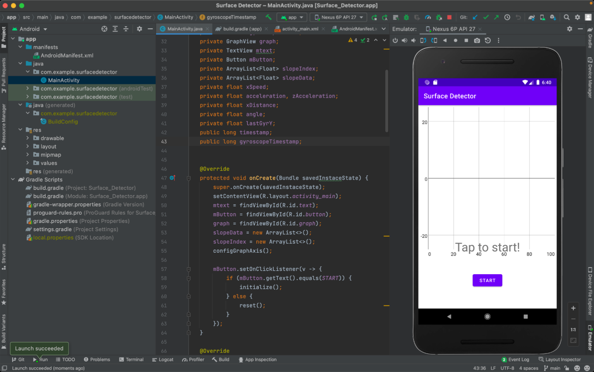
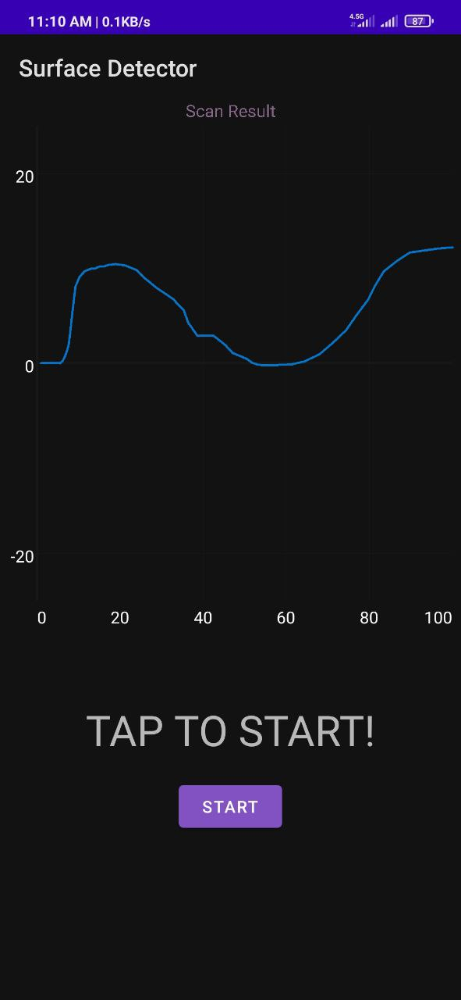

# surface-scanner

An android app that scans the surface using accelerometer and gyroscope sensors and displays it in a graph.

In implementing this application, points such as the sensors' inaccuracy and analyzing each sensor's outputs have been considered.

